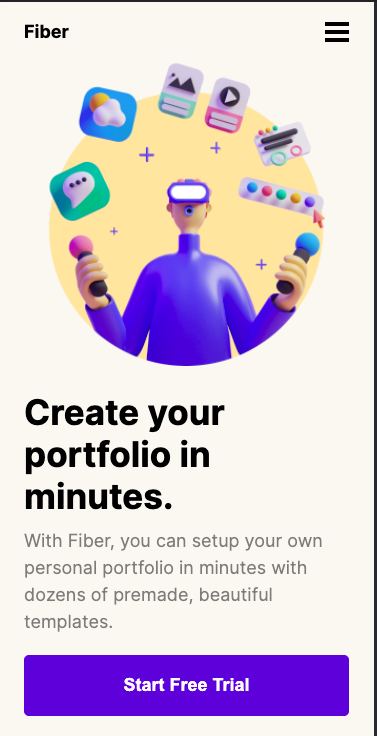
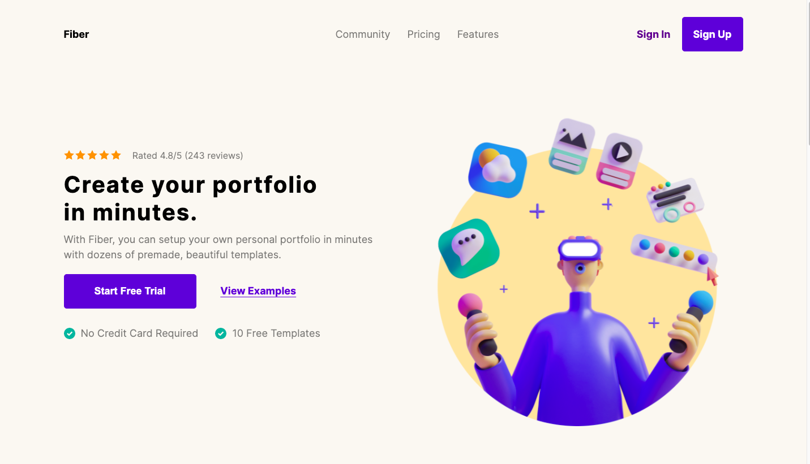

# Codewell - Fiber landing page solución

Esta es una solución al reto [Fiber landing page de Codewell](https://www.codewell.cc/challenges/fiber-landing-page--608a7e639691700015db16d1).

## Tabla de contenidos

- [Resumen](#resumen)
  - [Screenshot](#screenshot)
  - [Links](#links)
- [Mi proceso](#mi-proceso)
  - [Construido con](#construido-con)
- [Autor](#autor)

## Resumen

### Screenshot

### Links

- Solucion URL: [Github](https://github.com/robeurve/fiber-landing-page)
- Live Site URL: [Github Pages](https://robeurve.github.io/fiber-landing-page/)

## Mi Proceso

### Construido con

- HTML5 semantico
- CSS
- Flexbox
- CSS Grid
- Mobile-first 

## Autor

- github - [@robeurve](https://github.com/robeurve)
- Twitter - [@UrrutiaRonald](https://twitter.com/UrrutiaRonald)
